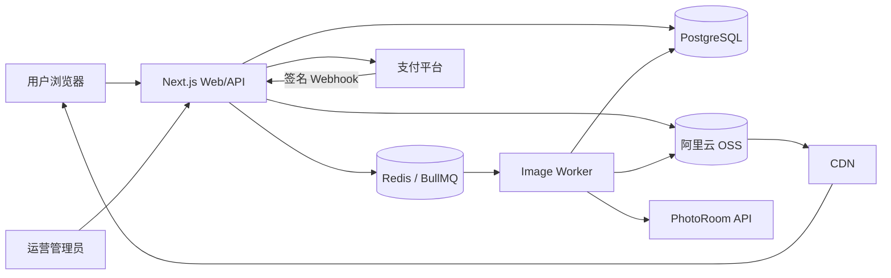

# 商业版项目基础架构设计

> 适用范围：Web 图片抠图、尺寸修改、账号体系、付费会员与用量管理
>
> 设计日期：2026-07-29

## 1. 设计目标

首版采用**模块化单体 + 独立图片处理 Worker**。Web、业务 API 和管理后台部署为一个应用，耗时的抠图与图片转换放入异步队列。暂不拆微服务。

系统必须保证：

- 用户可注册、登录、找回密码和注销账号。
- 用户付款后可靠地获得会员权益，重复支付回调不会重复发放。
- 每次付费抠图都有可审计的额度流水，失败任务自动退回额度。
- 原图、透明抠图结果和最终导出图分层保存，修改尺寸不重复调用付费 AI。
- API Key、支付密钥和对象存储密钥只存在服务端。
- 供应商故障、任务重试和支付回调重复投递不会造成重复扣费。

## 2. 推荐技术栈

| 层级 | 推荐方案 | 说明 |
| --- | --- | --- |
| Web 与业务 API | Next.js + TypeScript | 一个项目完成用户端、管理后台和 API，减少首版部署单元 |
| UI | Tailwind CSS + shadcn/ui | 适合工作台、账号和后台页面 |
| 登录认证 | Auth.js | 邮箱密码、OAuth、会话管理；密码使用 Argon2id |
| 数据库 | PostgreSQL | 账号、订单、会员、额度和任务的唯一事实来源 |
| ORM | Prisma | 类型安全迁移与事务支持 |
| 队列 | Redis + BullMQ | 图片任务、重试、并发控制和延迟任务 |
| 图片处理 | Sharp/libvips | 缩放、裁剪、背景合成和格式转换 |
| AI 抠图 | PhotoRoom Basic API | 首版只接一个供应商 |
| 文件存储 | 阿里云 OSS + 阿里云 CDN（可选） | 私有 Bucket 保存原图和结果图，使用 STS/签名 URL 控制访问 |
| 支付 | 按销售地区选一个支付渠道 | 中国大陆首版选微信支付或支付宝；海外首版选 Stripe |
| 邮件 | 事务邮件服务 | 邮箱验证、重置密码、付款和额度通知 |
| 监控 | Sentry + 结构化日志 | 前后端异常、任务失败和支付告警 |

不建议首版同时采用多个后端框架、多个支付渠道或多个抠图供应商。代码只保留清晰的模块边界，等真实需求出现再拆分。

## 3. 系统上下文



### 部署单元

1. `web`：页面、业务 API、认证、支付回调和管理后台。
2. `worker`：消费图片任务，调用 PhotoRoom 和 Sharp。
3. `postgres`：业务事实与审计数据。
4. `redis`：任务队列、短期缓存和限流。Redis 不保存最终额度余额。
5. `aliyun-oss`：使用私有 Bucket 保存原图、中间透明图和最终导出图；CDN 仅用于需要加速的结果图下载。

## 4. 代码目录

```text
cutout/
├─ src/
│  ├─ app/                    # Next.js 页面与 Route Handlers
│  │  ├─ (auth)/             # 登录、注册、验证、找回密码
│  │  ├─ (dashboard)/        # 抠图工作台、历史记录、会员中心
│  │  ├─ admin/              # 管理后台
│  │  └─ api/                # 上传、任务、支付和 Webhook API
│  ├─ modules/
│  │  ├─ auth/               # 身份、会话、验证邮件
│  │  ├─ billing/            # 商品、订单、支付回调
│  │  ├─ membership/         # 会员周期与权益判断
│  │  ├─ credits/            # 额度余额与不可变流水
│  │  ├─ images/             # 图片资产、上传和下载
│  │  ├─ jobs/               # 任务创建、状态机与队列
│  │  └─ admin/              # 用户、订单、任务和人工补偿
│  ├─ worker/                # BullMQ 消费者与 Sharp 流程
│  └─ lib/                   # DB、Redis、存储、日志等基础连接
├─ prisma/
│  └─ schema.prisma
├─ public/
├─ tests/
└─ package.json
```

`modules` 是代码组织方式，不是微服务。禁止模块直接修改其他模块的数据表，跨模块操作通过服务函数和数据库事务完成。

## 5. 核心业务模块

### 5.1 账号与权限

- 支持邮箱 + 密码注册。
- 注册后发送邮箱验证链接，验证前限制付费和高成本图片处理。
- 支持登录、退出、忘记密码、重置密码和所有设备退出。
- 角色只保留 `USER`、`SUPPORT`、`ADMIN`。
- 管理后台使用同一账号体系，但必须校验角色并记录管理操作。
- 后续可增加微信扫码或 Google 登录，不影响现有用户主键。

### 5.2 会员与权益

会员和额度是两个概念：

- **会员周期**决定最大文件、队列优先级、历史保留期、水印和并发数。
- **额度**决定还能执行多少次付费抠图。

建议首版提供：

| 套餐 | 周期 | 抠图额度 | 单文件限制 | 并发 | 历史保留 |
| --- | --- | ---: | ---: | ---: | ---: |
| Free | 长期 | 注册赠送少量一次性额度 | 10MB | 1 | 7 天 |
| Pro 月卡 | 30 天 | 每个会员周期发放固定额度 | 30MB | 2 | 30 天 |
| Pro 年卡 | 365 天 | 按月发放或一次性发放 | 50MB | 4 | 90 天 |

实际价格和额度应基于 PhotoRoom、存储、带宽、支付费率、退款率和税费计算，不能只按 API 单价定价。

中国大陆首版建议使用**预付费月卡/年卡**，付款成功后创建固定会员周期；不要一开始实现自动续费代扣。自动续费涉及签约、扣款授权、解约、失败重试和监管要求，应在渠道资质明确后增加。

### 5.3 额度账本

额度不能只在 `users` 表中保存一个可随意修改的数字。采用余额表 + 不可变流水：

- 注册赠送：`SIGNUP_GRANT`
- 购买套餐发放：`PLAN_GRANT`
- 创建抠图任务冻结：`JOB_HOLD`
- 任务成功核销：`JOB_CAPTURE`
- 任务失败退回：`JOB_RELEASE`
- 退款扣回：`REFUND_REVOKE`
- 管理员补偿：`ADMIN_ADJUSTMENT`

一次任务应先冻结额度，成功后核销，最终失败后释放。所有变更使用数据库事务和唯一幂等键。

### 5.4 图片资产与任务

图片分为三类：

- `ORIGINAL`：用户上传原图。
- `CUTOUT`：AI 生成的透明背景母版。
- `EXPORT`：由透明母版生成的尺寸和格式变体。

只有生成 `CUTOUT` 消耗 AI 抠图额度。对同一透明母版重复生成 `EXPORT` 不再消耗抠图额度，可按产品策略免费或限制每日次数。

任务状态：

```text
PENDING → QUEUED → PROCESSING → SUCCEEDED
                         └────→ RETRYING → PROCESSING
                         └────→ FAILED
PENDING/QUEUED ───────────────→ CANCELED
```

Worker 处理流程：

1. 原子领取任务并检查任务是否已成功。
2. 下载原图并使用 Sharp 校验格式、像素和方向。
3. 调用 PhotoRoom 生成透明母版。
4. 保存透明母版和缩略图。
5. 根据用户参数生成首个导出图。
6. 在同一业务事务中标记成功并核销冻结额度。
7. 失败时按错误类型重试；达到上限后标记失败并释放额度。

## 6. 数据模型

以下为核心表，不包含 Auth.js 自带会话表的全部字段。

### 用户与认证

```text
users
- id UUID PK
- email CITEXT UNIQUE
- password_hash NULLABLE
- email_verified_at NULLABLE
- role USER|SUPPORT|ADMIN
- status ACTIVE|SUSPENDED|DELETED
- created_at / updated_at / deleted_at

auth_accounts
- id UUID PK
- user_id FK
- provider
- provider_account_id
- UNIQUE(provider, provider_account_id)

sessions
- id / user_id / expires_at
```

### 商品、订单与支付

```text
plans
- id UUID PK
- code UNIQUE
- name
- duration_days
- credits
- price_amount          # 最小货币单位，例如分
- currency
- entitlements JSONB
- active

orders
- id UUID PK
- order_no UNIQUE
- user_id FK
- plan_id FK
- amount / currency
- status PENDING|PAID|CANCELED|REFUNDED|EXPIRED
- paid_at / created_at

payments
- id UUID PK
- order_id FK
- provider
- provider_payment_id
- status PENDING|SUCCEEDED|FAILED|REFUNDED
- amount / currency
- raw_summary JSONB
- UNIQUE(provider, provider_payment_id)

payment_events
- id UUID PK
- provider
- provider_event_id
- event_type
- payload JSONB
- processed_at NULLABLE
- UNIQUE(provider, provider_event_id)
```

订单金额和套餐权益在创建订单时保存快照，防止以后修改套餐价格影响历史订单。

### 会员与额度

```text
memberships
- id UUID PK
- user_id FK
- plan_code
- starts_at / ends_at
- status ACTIVE|EXPIRED|REVOKED
- source_order_id FK
- entitlement_snapshot JSONB

credit_accounts
- user_id PK/FK
- available
- held
- version

credit_ledger
- id UUID PK
- user_id FK
- type
- available_delta
- held_delta
- reference_type
- reference_id
- idempotency_key UNIQUE
- expires_at NULLABLE
- created_at
```

### 图片与任务

```text
image_assets
- id UUID PK
- user_id FK
- kind ORIGINAL|CUTOUT|EXPORT|THUMBNAIL
- parent_asset_id NULLABLE
- storage_key UNIQUE
- content_hash
- mime_type / width / height / byte_size
- expires_at NULLABLE
- created_at / deleted_at

image_jobs
- id UUID PK
- user_id FK
- type REMOVE_BACKGROUND|EXPORT
- source_asset_id FK
- status
- params JSONB
- provider NULLABLE
- provider_request_id NULLABLE
- attempt_count
- error_code / error_message
- idempotency_key
- started_at / finished_at / created_at
- UNIQUE(user_id, idempotency_key)

job_outputs
- job_id FK
- asset_id FK
- PRIMARY KEY(job_id, asset_id)
```

### 审计

```text
admin_audit_logs
- id UUID PK
- actor_user_id FK
- action
- target_type / target_id
- reason
- metadata JSONB
- created_at
```

## 7. 关键业务流程

### 7.1 注册登录

```text
提交邮箱和密码
→ 规范化邮箱并检查唯一性
→ Argon2id 哈希密码
→ 创建用户和验证令牌
→ 发送验证邮件
→ 用户验证邮箱
→ 发放一次性新用户额度
→ 建立服务端会话
```

验证令牌只保存哈希值并设置过期时间。登录接口需要 IP + 账号维度限流，连续失败增加短暂冷却时间。

### 7.2 购买会员

```text
用户选择套餐
→ 服务端按数据库中的有效套餐创建订单
→ 服务端向支付平台创建支付单
→ 用户完成付款
→ 支付平台发送 Webhook
→ 验签并持久化 payment_event
→ 数据库事务：订单置为 PAID、创建会员周期、发放额度
→ 返回会员中心展示最新权益
```

前端支付完成页只能轮询订单结果，不能自行把订单改为已付款。会员权益以服务端验签后的 Webhook 为准。

支付回调必须：

- 使用支付平台原始请求体验签。
- 校验商户号、订单号、金额和币种。
- 先用 `provider_event_id` 去重，再执行权益发放。
- 在数据库事务中更新订单、会员和额度流水。
- 快速返回成功；非必要操作放入队列。

### 7.3 创建抠图任务

```text
客户端请求上传凭证
→ 使用服务端签发的 OSS STS 临时凭证直传临时目录
→ 客户端提交 storage_key 与处理参数
→ 服务端验证文件归属和元数据
→ 事务内冻结 1 个额度并创建任务
→ 推送 BullMQ
→ Worker 生成 CUTOUT 与 EXPORT
→ 成功核销额度，失败释放额度
→ 客户端轮询任务或通过 SSE 获取状态
```

首版状态更新使用短轮询即可；只有实时体验确实不足时再增加 SSE，不需要先上 WebSocket。

## 8. API 设计

统一前缀：`/api/v1`。

### 认证与账号

```text
POST   /auth/register
POST   /auth/login
POST   /auth/logout
POST   /auth/email/verify
POST   /auth/password/forgot
POST   /auth/password/reset
GET    /me
DELETE /me
```

### 套餐、订单与会员

```text
GET    /plans
POST   /orders
GET    /orders/:id
POST   /payments/:provider/webhook
GET    /membership
GET    /credits
GET    /credits/ledger
```

### 图片与任务

```text
POST   /uploads/presign
POST   /uploads/complete
POST   /jobs/remove-background
POST   /jobs/export
GET    /jobs/:id
GET    /jobs
POST   /jobs/:id/cancel
GET    /assets/:id/download
DELETE /assets/:id
```

### 管理后台

```text
GET    /admin/users
GET    /admin/orders
GET    /admin/jobs
POST   /admin/users/:id/credits/adjust
POST   /admin/users/:id/suspend
POST   /admin/jobs/:id/retry
```

所有创建订单、创建任务和管理员额度调整接口都接受 `Idempotency-Key`。

## 9. 安全基线

- 密码使用 Argon2id，禁止自行实现密码算法。
- 会话 Cookie 使用 `HttpOnly`、`Secure`、`SameSite=Lax`。
- 状态修改接口启用 CSRF 防护；所有输入使用统一 Schema 校验。
- 登录、注册、找回密码、上传和任务创建分别限流。
- OSS Bucket 必须为私有，禁止公共读写和目录遍历。
- 使用 RAM 子账号和最小权限 Policy；浏览器只获取短期 STS 凭证，永久 AccessKey 不进入前端。
- STS Policy 限定用户上传前缀、Content-Type、文件大小和短过期时间。
- OSS 回调或 `uploads/complete` 接口必须再次校验对象路径、归属、大小和 MIME。
- 下载使用短期签名 URL；接入阿里云 CDN 后使用 CDN 鉴权 URL，不能直接开放源站。
- Worker 再次解析图片并限制最大像素数，不能信任浏览器声明。
- 用户只能访问以自己用户 ID 为归属的资源；管理员越权操作写入审计日志。
- Webhook 使用独立路由读取原始请求体并验签。
- 日志禁止记录密码、令牌、支付完整报文、图片签名 URL 和 API Key。
- 数据库、Redis、OSS RAM 身份和第三方密钥分别配置最小权限。
- OSS 配置生命周期规则：临时上传自动清理，原图和导出图按会员保留期删除，未完成的分片上传自动终止。
- 发布隐私政策、服务协议、会员规则和退款规则，并取得上传图片处理授权。

## 10. 可靠性与对账

- BullMQ 使用固定重试次数和指数退避，只重试超时、429 和 5xx。
- 4xx 参数错误不自动重试。
- Worker 每一步写入结构化日志：`job_id`、`user_id`、供应商、耗时、尝试次数和费用。
- 每日运行支付对账：平台成功支付必须能匹配本地订单和会员权益。
- 每日运行额度核对：`credit_accounts` 必须等于有效流水汇总。
- 监控队列堆积、P95 处理时间、失败率、供应商费用和支付回调失败。
- 管理后台允许人工重试任务和补偿额度，但必须填写原因并写审计日志。

## 11. 环境与部署

### 环境

- `local`：本地 PostgreSQL、Redis；OSS 使用独立开发 Bucket 和受限 RAM 身份。
- `staging`：支付沙箱、PhotoRoom Sandbox、独立数据库、OSS 测试 Bucket 和 RAM 身份。
- `production`：正式支付、正式 API Key、备份和告警。

环境之间禁止共享数据库、OSS Bucket、RAM 身份、支付密钥和 AI API Key。

### 生产部署

```text
CDN / WAF
  → Web 容器（可水平扩容）
  → PostgreSQL 托管实例
  → Redis 托管实例
  → Worker 容器（按队列扩容）
  → 阿里云 OSS + 阿里云 CDN（可选）
```

Web 与 Worker 使用同一代码仓库和数据模型，但运行不同启动命令。数据库每日备份并定期验证恢复；部署执行向后兼容迁移，应用稳定后再删除旧字段。

## 12. MVP 页面

### 用户端

- `/login`、`/register`、`/forgot-password`
- `/app`：上传和图片处理工作台
- `/app/history`：任务与历史图片
- `/app/billing`：套餐、当前会员、额度与订单
- `/app/settings`：账号、安全和注销
- `/payment/result`：支付结果查询

### 管理端

- `/admin`：收入、任务量、失败率和供应商费用
- `/admin/users`：用户状态、会员和额度
- `/admin/orders`：支付、退款和对账状态
- `/admin/jobs`：失败任务、错误信息和人工重试
- `/admin/audit`：管理员操作记录

## 13. 开发阶段

### 阶段一：账号与基础设施

- 初始化 Next.js、PostgreSQL、Prisma、Auth.js、Redis 和阿里云 OSS。
- 完成注册、邮箱验证、登录、找回密码和账号设置。
- 完成角色权限与管理后台入口。

### 阶段二：图片处理闭环

- 完成直传、图片资产、任务状态机和 BullMQ Worker。
- 接入 PhotoRoom Sandbox。
- 使用 Sharp 完成 contain、cover、背景和格式转换。
- 完成历史记录、下载、删除、额度冻结与失败释放。

### 阶段三：商业闭环

- 完成套餐、订单、支付 Webhook、会员周期和额度发放。
- 完成会员中心、订单记录、管理端人工补偿和支付对账。
- 增加费用、失败率和队列告警。

### 阶段四：上线准备

- 使用真实图片做质量与成本测试。
- 完成安全检查、备份恢复演练和支付沙箱测试。
- 发布用户协议、隐私政策、会员与退款规则。
- 小流量灰度后再开放正式付费。

## 14. 暂不实现

- 微服务和 Kubernetes。
- 同时接入多个抠图供应商。
- 自建抠图模型。
- 自动续费代扣。
- 团队空间、企业账号和复杂 RBAC。
- 复杂模板编辑器、批处理和开放 API。
- WebSocket；首版任务状态使用短轮询。

这些功能应在用户量、供应商风险或商业合同明确要求后再加入。
